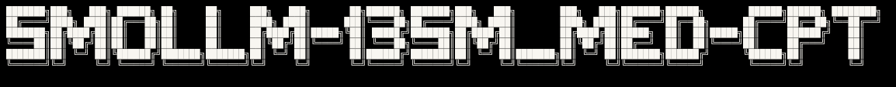

<p align="center">
  
</p>


Medical-domain continued pre-training (CPT) pipeline for HuggingFaceTB's
SmolLM-135M model. Trains on PubMed, PMC, Medline, and FineWeb datasets
using LoRA adapters with the Unsloth framework.

---

## Pipeline

```
┌──────────────────┐     ┌──────────────────┐
│  1. LOAD MODEL   │ ──► │  2. BASELINE     │
│  (4-bit NF4)     │     │  EVAL (untrained)│
└──────────────────┘     └──────────────────┘
                                 │
                                 ▼
                          ┌──────────────────┐
                          │  Perplexity      │
                          │  + Benchmarks    │
                          └──────────────────┘
                                 │
                                 ▼
┌──────────────────┐     ┌──────────────────┐
│  3. TRAIN        │ ◄── │  4. DATA PHASE   │
│  (LoRA + CPT)    │     │  (inside train)  │
└──────────────────┘     └──────────────────┘
        │
        ▼
┌──────────────────┐     ┌──────────────────┐
│  5. SAVE         │ ──► │  6. POST-TRAIN   │
│  Merged 16-bit   │     │  EVAL (trained)  │
└──────────────────┘     └──────────────────┘
                                 │
                                 ▼
                          ┌──────────────────┐
                          │  Perplexity       │
                          │  + Benchmarks     │
                          └──────────────────┘
```

### Step-by-Step

1. **Load Model** (`model_utils.py`) — Loads SmolLM-135M in 4-bit (NF4) via Unsloth with bfloat16 compute dtype.

2. **Baseline Eval** — Evaluates the untrained base model on perplexity (PubMed Abstracts, Medline) and benchmarks (PubMedQA, MedMCQA).

3. **Data Phase** (`data.py`) — Downloads and tokenizes biomedical datasets (PubMed, PMC, Medline, FineWeb; 200K samples), splits 90/10 train/val, writes to text files, loads into HuggingFace Datasets. Called inside `train.py`.

4. **Training** (`train.py`) — Loads base model, attaches LoRA adapters (rank 32), tokenizes datasets into packed sequences, runs 1 epoch of CPT with UnslothTrainer.

5. **Export** — Saves a merged 16-bit model to `SmolLM-135M_Med_Merged/`.

6. **Post-Training Eval** — Re-runs perplexity and benchmarks on the trained model.

---

## Configuration

All paths and hyperparameters are set in `config.yaml`:

| Key | Value | Description |
|-----|-------|-------------|
| `MODEL_NAME` | `HuggingFaceTB/SmolLM-135M` | Base model |
| `SEED` | `42` | Random seed |
| `MAX_SEQ_LENGTH` | `512` | Max sequence length |
| `OVERLAP` | `128` | Overlap (reserved) |
| `data_file` | `./data/dataset.txt` | Combined dataset path |
| `train_file` | `./data/train.txt` | Training data path |
| `val_file` | `./data/val.txt` | Validation data path |

---

## Training Details

### Model
- **Base**: HuggingFaceTB/SmolLM-135M (135M parameters)
- **Precision**: 4-bit loaded (NF4), merged to 16-bit on save
- **Sequence length**: 512 tokens

### LoRA Configuration
| Parameter | Value |
|-----------|-------|
| Rank (`r`) | 32 |
| LoRA alpha | 32 |
| LoRA dropout | 0 |
| Bias | none |
| Gradient checkpointing | `"unsloth"` |
| Target modules | `q_proj`, `k_proj`, `v_proj`, `o_proj`, `gate_proj`, `up_proj`, `down_proj`, `embed_tokens`, `lm_head` |

### Training Hyperparameters
| Parameter | Value |
|-----------|-------|
| Epochs | 1 |
| Per-device batch size | 128 |
| Per-device eval batch size | 16 |
| Gradient accumulation | 1 |
| Effective batch size | 128 |
| Learning rate | 5e-5 |
| Embedding learning rate | 5e-6 |
| LR scheduler | Cosine |
| Warmup ratio | 0.05 |
| Optimizer | AdamW 8-bit |
| Weight decay | 0.01 |
| Max grad norm | 1.0 |
| Packing | Disabled (manual chunking) |
| Dataset num procs | 2 |
| Eval strategy | Every 1000 steps |
| Save strategy | Every 1000 steps (keep 3) |
| Load best model at end | Yes |
| Metric for best model | Eval loss |

### Datasets (200,000 total samples)
| Source | Samples | Key |
|--------|---------|-----|
| PubMed Abstracts | 120,000 | `abstract` |
| PMC (PubMed Central) | 40,000 | `text` |
| Medline | 20,000 | `content` |
| FineWeb | 20,000 | `text` |

- **Split**: 90% train / 10% validation (per-source random split)
- **Pre-tokenization**: Tokenized with SmolLM-135M tokenizer to count tokens

### Evaluation
- **Perplexity**: Sliding-window (window=512, stride=256) on PubMed Abstracts and Medline (1,000 samples each)
- **Benchmarks**: PubMedQA (yes/no/maybe) and MedMCQA (4-option MCQ) — 200 samples each
- **Results**: Saved to `./results/` as JSON with `_untrained` and `_trained` suffixes

---

## Usage

```bash
# Run the full pipeline
uv run main.py
```

### Dependencies

- Python >= 3.13
- unsloth
- datasets
- omegaconf
- evaluate

Install with uv:

```bash
uv sync
```

---

## Project Structure

```
├── main.py              # Pipeline entry point
├── train.py             # LoRA training with UnslothTrainer
├── data.py              # Dataset download & preprocessing
├── model_utils.py       # Shared model loading & config
├── config.yaml          # Configuration (paths & hyperparams)
├── pyproject.toml       # Project metadata & dependencies
├── evals/
│   ├── __init__.py
│   ├── benchmarks.py    # PubMedQA & MedMCQA evaluation
│   └── perplexity.py    # Sliding-window perplexity
└── results/             # Evaluation outputs (JSON: _untrained / _trained)
```

## Training results:

| Metric      | Untrained |   Trained |          Change |
| ----------- | --------: | --------: | --------------: |
| PubMed PPL  |     18.76 | **15.03** |      **-19.9%** |
| Medline PPL |     14.24 | **11.39** |      **-20.0%** |
| PubMedQA    | **49.5%** |     41.5% | **-8.0 points** |
| MedMCQA     |     20.0% | **22.0%** |     +2.0 points |


The training achieved its primary objective—domain adaptation—as shown by the consistent ~20% perplexity reduction. 
However, it did not translate into better downstream medical QA.